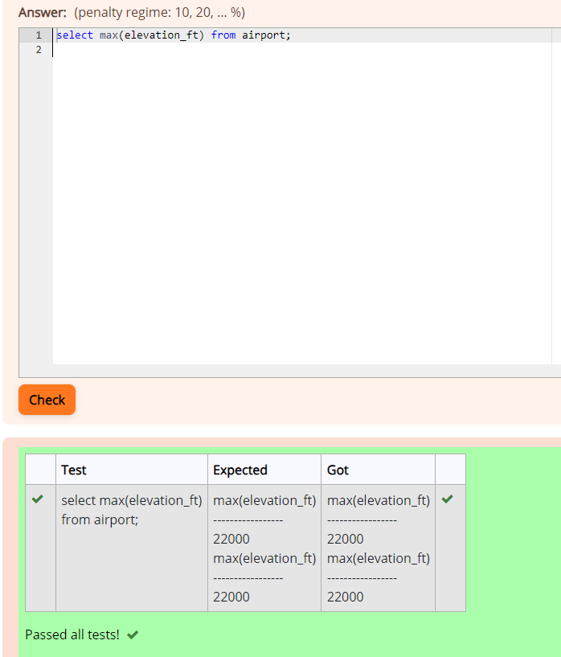
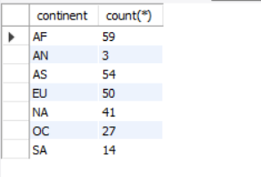
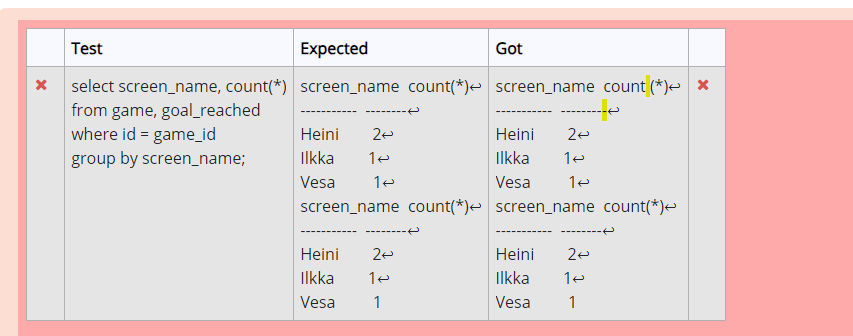
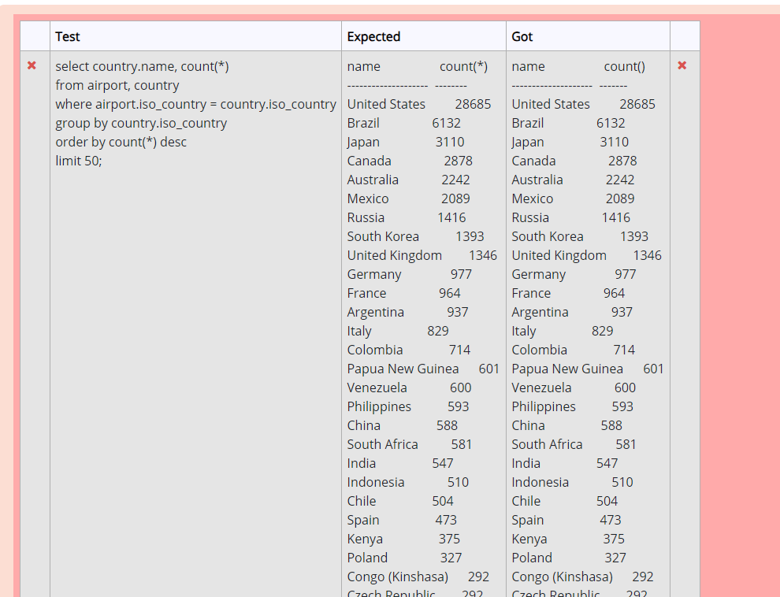
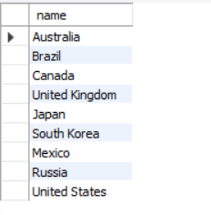
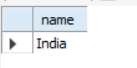

### Assignment: Ex-6 Aggregate Queries

### Question 1
select max(elevation_ft) from airport;

### Question 2
Select continent, count(*) from country group by continent;

### Question 3
select screen_name, count (*) from game, goal_reached where id = game_id group by screen_name;

### Question 4
select screen_name from game where co2_consumed in(select min(co2_consumed) from game);

### Question 5
select country.name, count() from airport, country where airport.iso_country = country.iso_country group by country.iso_country order by count() desc limit 50;

### Question 6
select country.name from airport, country where airport.iso_country = country.iso_country group by country.iso_country having count(*) > 1000;

### Question 7
select name from airport where elevation_ft in (select max(elevation_ft) from airport);

### Question 8
select name from country where iso_country in (select iso_country from airport where elevation_ft in( select max(elevation_ft) from airport));

### Question 9
select count(*) from game, goal_reached where id = game_id and screen_name = "Vesa" group by screen_name;

### Question 10
select name from airport where latitude_deg in(select min(latitude_deg) from airport);
