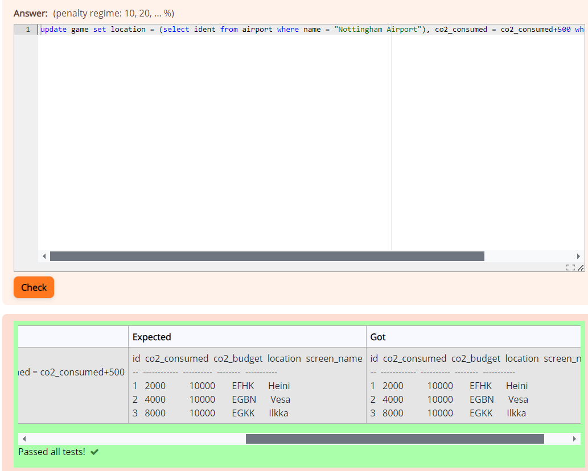
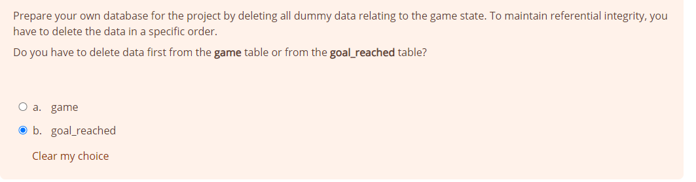
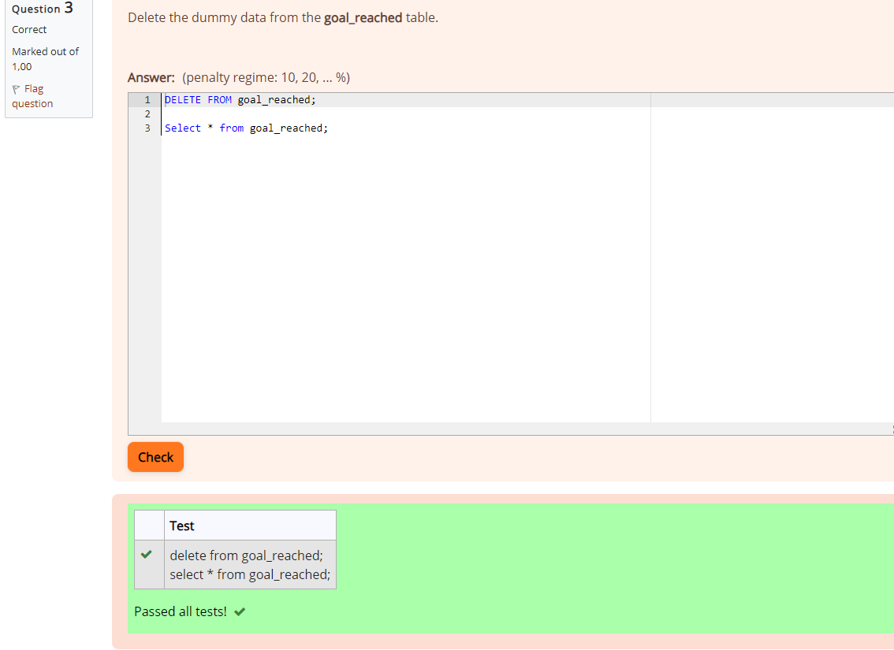
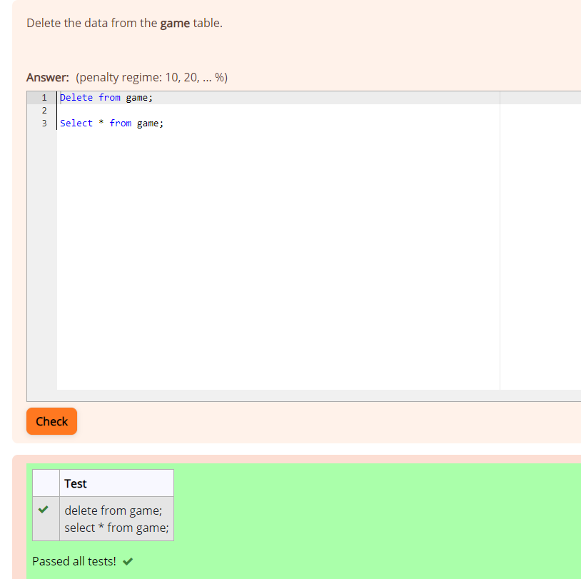

### Exercises 7: Update Queries

### Question 1
update game set location = (select ident from airport where name = "Nottingham Airport"), co2_consumed = co2_consumed+500 where screen_name = "Vesa";

### Question 2
Goal_reached

### Question 3
DELETE FROM goal_reached;

Select * from goal_reached;

### Question 4
Delete from game;

Select * from game;
